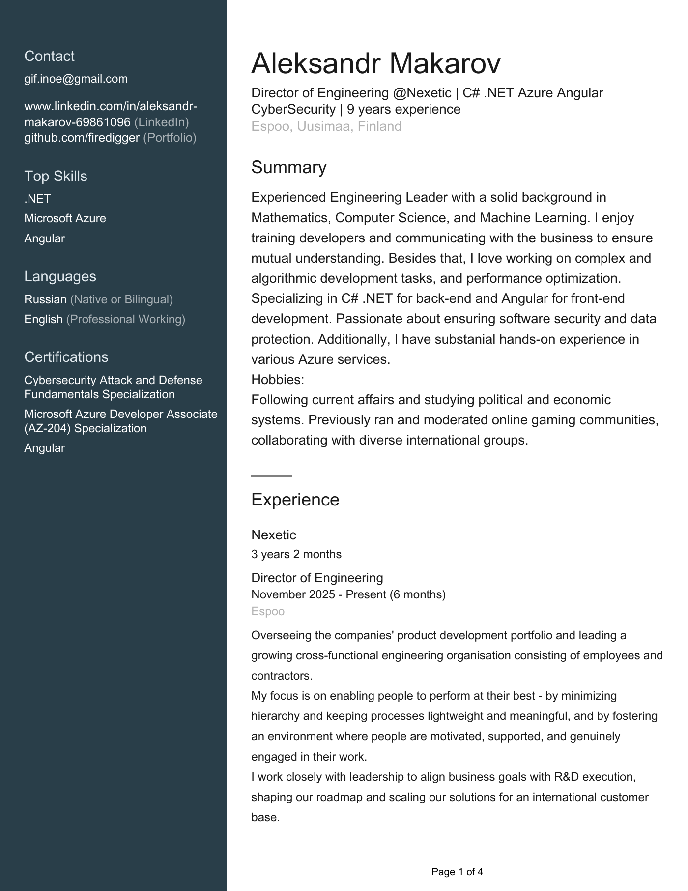
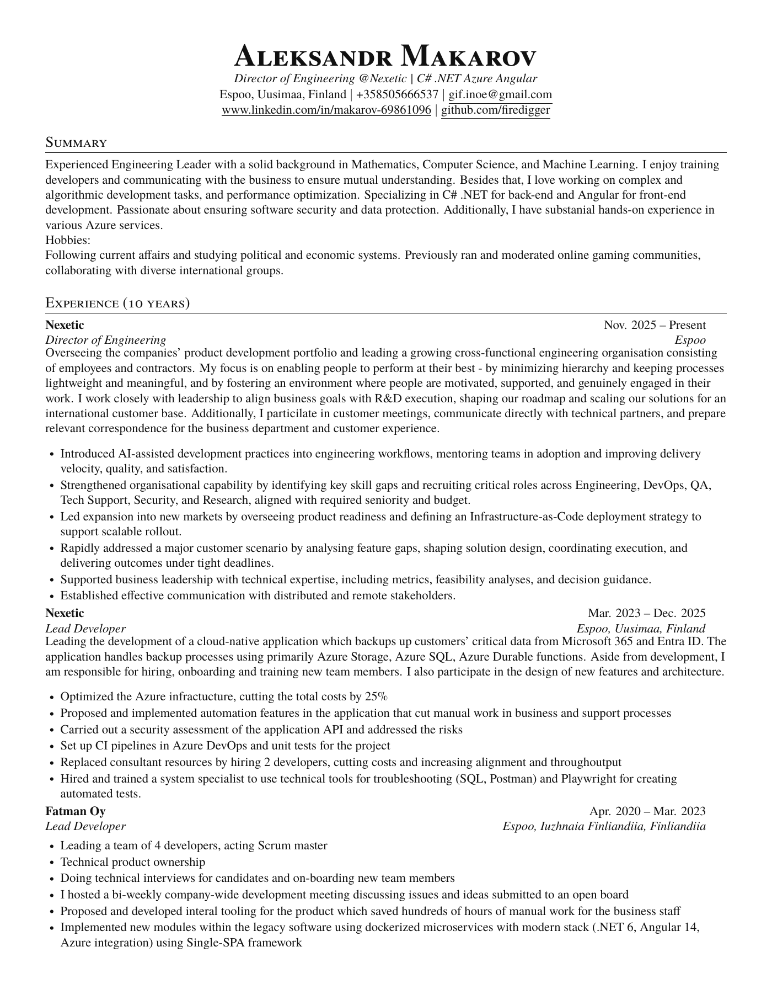

# LinkedIn PDF → JSON Resume / Europass / LaTeX

Keep a single source of truth for your resume and export it from a LinkedIn PDF into JSON Resume, Europass XML, and a clean SWE LaTeX/PDF CV. You can customize the output via supplying additional info or editing intermediate outputs.
For best experience also export LinkedIn data archive from Settings&Privacy to supply the full info to the output.
No LLM required. Built via OpenAI Codex.

## What this tool can do
- Parse a LinkedIn profile PDF into JSON Resume (`resume.json`) using the open schema: https://jsonresume.org
- JSON Resume can be converted into many community themes; explore options at https://jsonresume.org/themes and the CLI at https://github.com/jsonresume/resume-cli.
- Merge extra personal details from `personal_info.json` (e.g., phone, birth date, nationality, additional_skills) where LinkedIn lacks data.
- Export JSON Resume to Europass Candidate XML (`europass.xml`) for import into the Europass editor: https://europass.europa.eu/en
- Render JSON Resume into a customized version of Jake's LaTeX resume template (`resume.tex`) and compile a PDF (`resume.pdf`), including optional sections like summary, certificates, and languages. A base template is also available as `template_basic.tex`.

## Example input and output
LinkedIn export input (first page) and LaTeX SWE output (first page):
<p>
  
  
</p>

## Disclaimer
LinkedIn PDF parsing is best-effort and may miss or misclassify fields. Always review the generated `resume.json`, `europass.xml`, and `resume.pdf` before using them. If you want to tailor the output to your resume style or data, use AI in this repo to adjust the underlying Python code. Use malformed `resume.json` output and any missing fields to pinpoint what needs fixing.

## Background
I keep my LinkedIn profile up to date and wanted a single source of truth that could generate multiple formats: Europass, and a clean PDF using Jake's popular SWE resume template. I then modified Jake's template to include more of LinkedIn profile exports.

## Why not a web app?
A hosted web app would need robust PDF parsing and résumé cleanup, which typically means an LLM in the loop. That turns it into a paid service (like sweresume.app 5$ per generation). This repo keeps everything local and scriptable, so if you are an engineer (especially with a Copilot license, personal or work-related), you can clone it and tailor the output quickly. If it helps, all I ask in return is a star on the repo.

## Template notes
The LaTeX template in `template.tex` is a modification of Jake's original resume layout. It adds extra sections (summary, certifications, languages) and a compact contact/header layout to fit typical LinkedIn exports.

## Requirements
- Python 3.11+
- LaTeX engine: `pdflatex` for ASCII-only output, `xelatex` or `lualatex` for Unicode output (MiKTeX or TeX Live). MiKTeX download: https://miktex.org/download

## Installation
```bash
pip install -r requirements.txt
```

## Usage
LinkedIn export: open the profile, click `More` → `Save to PDF`.

Quick start (full pipeline):
Fill out `personal_info.json` first (phone, location, nationality, additional_skills, etc.) so missing LinkedIn data is merged into the output. If you have LinkedIn exports for skills, certifications, or projects, drop them as `Skills.csv`, `Certifications.csv`, and `Projects.csv` to merge into the resume data. LinkedIn export path: Settings & Privacy → Data privacy → Get a copy of your data → Request archive (All data).
```powershell
.\linkedin-to-latex-pdf.ps1 -LinkedInPdf path\to\LinkedIn_Profile.pdf
```
Outputs are named from the input PDF (e.g., `LinkedIn_Profile_resume.json`, `LinkedIn_Profile_europass.xml`, `LinkedIn_Profile_SWE.pdf`).
Add `-Basic` to keep only the original template sections in the LaTeX output.
Use `-Latinize` to transliterate non-ASCII text and force `pdflatex`, or `-ForcePdfLatex` to skip Unicode engine switching.
The LaTeX output defaults to a light theme; use `-Dark` for a dark background.

### Optional arguments (defaults)
Only the LinkedIn PDF path is required; everything else has a sensible default.

`linkedin-to-latex-pdf.ps1`:

| Argument | Required | Default |
| --- | --- | --- |
| `-LinkedInPdf` | Yes | (none) |
| `-ResumeJson` | No | `<pdf>_resume.json` |
| `-PersonalInfo` | No | `personal_info.json` |
| `-SkillsCsv` | No | `Skills.csv` |
| `-CertificationsCsv` | No | `Certifications.csv` |
| `-ProjectsCsv` | No | `Projects.csv` |
| `-Template` | No | `template.tex` |
| `-TexOut` | No | `<pdf>_SWE.tex` |
| `-EuropassXml` | No | `<pdf>_europass.xml` |
| `-EuropassConfig` | No | `europass_config.json` |
| `-SkipEuropass` | No | `false` |
| `-Basic` | No | `false` |
| `-Latinize` | No | `false` |
| `-ForcePdfLatex` | No | `false` |
| `-Dark` | No | `false` |

`json-to-latex-pdf.ps1`:

| Argument | Required | Default |
| --- | --- | --- |
| `-Resume` | No | `resume.json` |
| `-Template` | No | `template.tex` |
| `-TexOut` | No | `resume.tex` |
| `-Basic` | No | `false` |
| `-Latinize` | No | `false` |
| `-ForcePdfLatex` | No | `false` |
| `-Dark` | No | `false` |

Python modules:

| Command | Required | Defaults |
| --- | --- | --- |
| `python -m linkedin_resume_parser.cli <pdf>` | `<pdf>` | `-o resume.json --personal-info personal_info.json --skills-csv Skills.csv --certifications-csv Certifications.csv --projects-csv Projects.csv` |
| `python -m linkedin_resume_parser.europass [resume.json]` | (none) | `resume.json -m personal_info.json -c europass_config.json -o europass.xml` |
| `python -m linkedin_resume_parser.latex [resume.json]` | (none) | `resume.json -t template.tex -o resume.tex` |

Individual steps:
Parse a LinkedIn PDF into `resume.json`:
```bash
python -m linkedin_resume_parser.cli path\to\LinkedIn_Profile.pdf -o resume.json
```

Export `resume.json` to Europass Candidate XML (defaults to `resume.json` if omitted):
```bash
python -m linkedin_resume_parser.europass -m personal_info.json -c europass_config.json -o europass.xml
```

Render `resume.json` to LaTeX and PDF (defaults to `resume.json` if omitted; uses `xelatex`/`lualatex` when Unicode is detected):
```powershell
.\json-to-latex-pdf.ps1 -Template template.tex -TexOut resume.tex
```
You can edit the generated `resume.tex` to polish content or formatting before compiling the PDF.
Basic (original template sections only):
```powershell
.\json-to-latex-pdf.ps1 -Template template_basic.tex -TexOut resume_basic.tex
```

The same flag works with the Python renderer; it will auto-select `template_basic.tex` when you keep the default `template.tex`:
```bash
python -m linkedin_resume_parser.latex -t template.tex -o resume.tex --basic
```
Add `--latinize` to transliterate non-ASCII text and keep the `pdflatex` pipeline. Use `--font "Font Name"` to override the Unicode font. Add `--dark` for a dark theme.

## Files
- `*_resume.json`: JSON Resume output from the LinkedIn parser.
- `personal_info.json`: Personal metadata not exported from LinkedIn (e.g., birth date, nationality, additional_skills).
- `Skills.csv`: Optional LinkedIn skills export (Name column) that is merged into `resume.json`. Get it from LinkedIn: Settings & Privacy → Data privacy → Get a copy of your data → Request archive (All data).
- `Certifications.csv`: Optional LinkedIn certifications export used to enrich `resume.json` certificates (issuer, dates, URLs).
- `Projects.csv`: Optional LinkedIn projects export used to enrich `resume.json` projects (description, dates, URLs).
- `europass_config.json`: Europass technical configuration (schemes, rendering, section order, ESCO URI).
- `*_europass.xml`: Europass Candidate XML output.
- `*_SWE.tex`: LaTeX output from the resume renderer.
- `*_SWE.pdf`: PDF output from the selected LaTeX engine (`pdflatex`, `xelatex`, or `lualatex`).

## TODO
- [ ] Explore LinkedIn alternatives (hh.ru?)
- [ ] Write a LinkedIn post about the project + add to my CV projects
